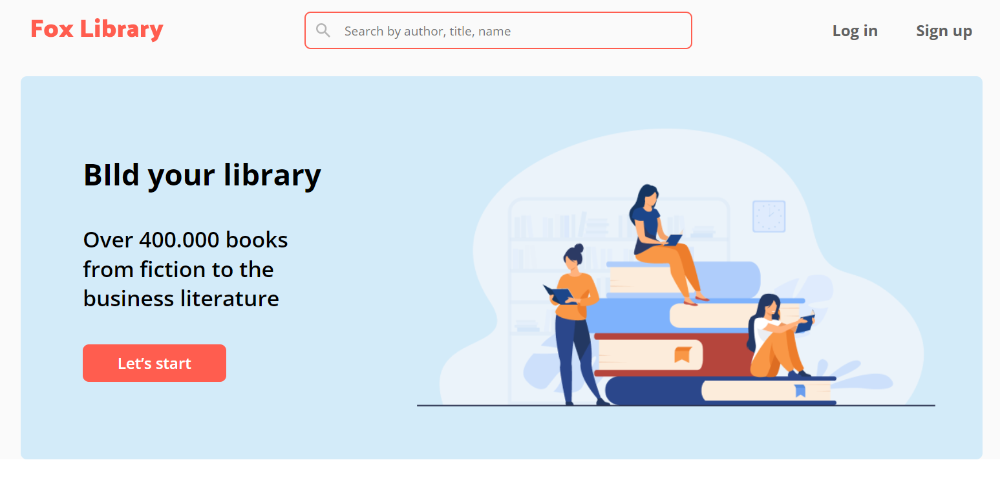
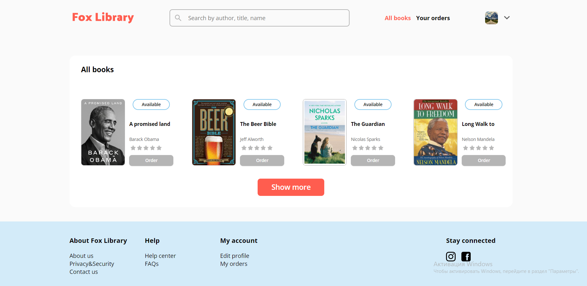
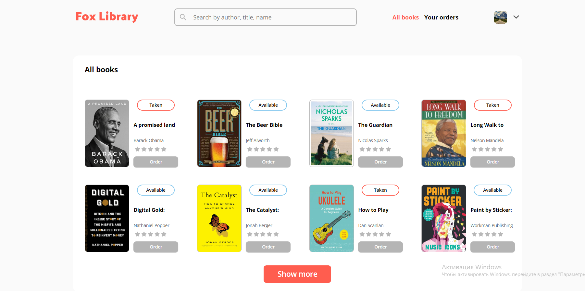
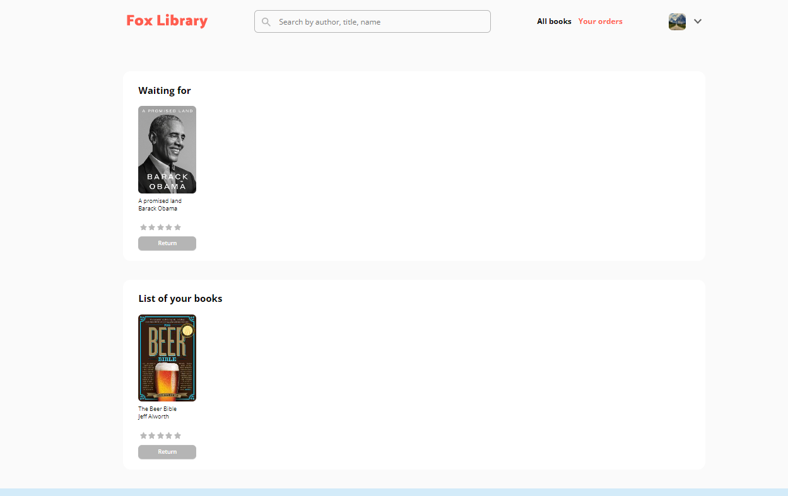
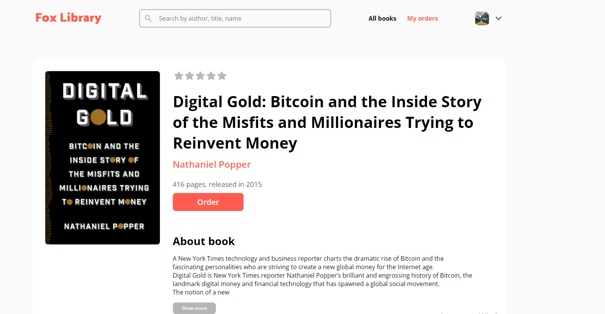

# Fox Library (Diplom-project)

- First project at React
- `Flexbox`, `Styled-Components`, `Redux-toolkit`, `Typescript`

## Start Page 

## All books page

## Click the button "Show more" + Books have two states "Taken" and "Available"

  
## Book in status Taken falls into the Waiting Unit, a book in status Available in block List

  
## Book description

